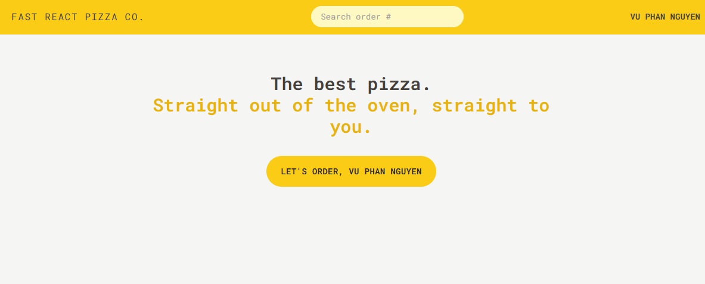

# Fast React Pizza

A simple ReactJS application for ordering pizzas. This project demonstrates the use of modern React features, routing, state management, and CSS frameworks.

## Features

- Using pizza data from [react-fast-pizza-api](https://react-fast-pizza-api.onrender.com/api)
- Redux Toolkit for state management
- Modern React Router setup with `createBrowserRouter`
- Tailwind CSS for styling

## Screenshots
### Home Page


### Menu Page


### Cart Page


### Order Page


## Project Setup

1. Clone the repository:
   ```sh
   git clone https://github.com/username/fast-react-pizza.git

2. Install dependencies:
   ```sh
   npm install

3. Start development server:
   ```sh
   npm run dev

## Project Setup
```
fast-react-pizza/
├── public/
├── src/
│   ├── features/
│   │   ├── cart/
│   │   ├── menu/
│   │   ├── order/
│   │   └── user/
│   ├── services/
│   │   ├── apiGeocoding.js
│   │   └── apiRestaurant.js
│   ├── ui/
│   │   ├── AppLayout.jsx
│   │   ├── Button.jsx
│   │   ├── Error.jsx
│   │   ├── Header.jsx
│   │   ├── Home.jsx
│   │   ├── LinkButton.jsx
│   │   └── Loader.jsx
│   ├── utils/
│   ├── App.jsx
│   ├── index.css
│   ├── main.jsx
│   └── store.js
├── .eslintrc.json
├── .gitignore
├── index.html
├── package-lock.json
├── package.json
├── postcss.config.js
├── prettier.config.js
├── tailwind.config.js
└── vite.config.js

```

## Routing Setup
```sh
const router = createBrowserRouter([
  {
    element: <AppLayout />,
    errorElement: <Error />,

    children: [
      {
        path: '/',
        element: <Home />,
      },
      {
        path: '/menu',
        element: <Menu />,
        loader: menuLoader,
        errorElement: <Error />,
      },
      { path: '/cart', element: <Cart /> },
      {
        path: '/order/new',
        element: <CreateOrder />,
        action: createOrderAction,
      },
      {
        path: '/order/:orderId',
        element: <Order />,
        loader: orderLoader,
        action: updateOrderAction,
        errorElement: <Error />,
      },
    ],
  },
]);

function App() {
  return <RouterProvider router={router} />;
}
```

## Contribution
Feel free to fork this project and submit pull requests. Any contributions are greatly appreciated.

## License
This project is licensed under the MIT License.
